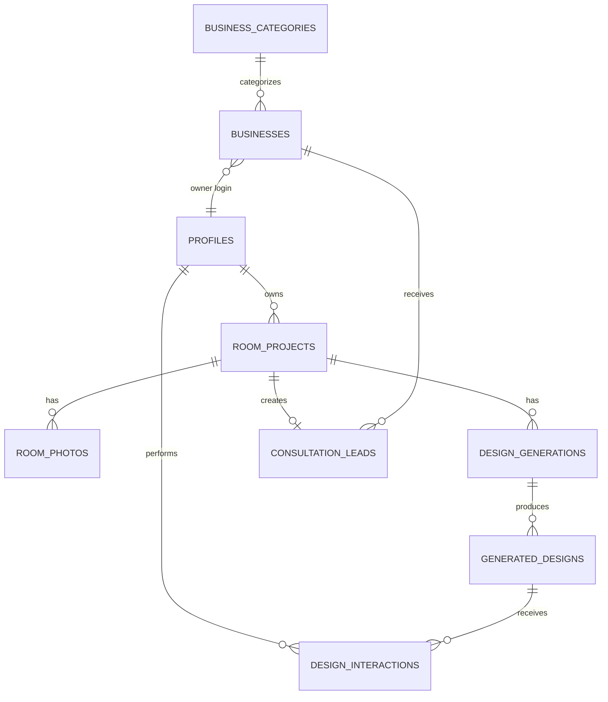

# PRD — AI Home Interior SaaS MVP V1

**Version:** 1.0
**Status:** Locked scope — ready for implementation
**Audience:** Developer / AI coding agent

---

## 1. Product Overview

An AI-powered Home Interior Design SaaS. A homeowner uploads photos of a room, picks a room type and a style, and receives 4–6 AI-generated redesign concepts. If they like one, they submit a consultation request, which becomes a lead for a home-improvement business.

Long-term vision (NOT this document): room photos → AI designs → design selection → product/provider discovery → professional help → completed makeover.

This PRD covers **only MVP V1**: a narrow, validation-focused slice of that vision.

**Hypothesis being tested:** If a homeowner uploads room photos and gets multiple realistic AI-generated interior concepts, will they browse, save/select a design, and request a consultation?

---

## 2. Problem Statement

Homeowners who want to redesign a room have no fast, low-friction way to visualize what it could look like before spending money on design help, furniture, or renovation. Existing options (hiring a designer, browsing inspiration sites, trial-and-error shopping) are slow, expensive, or not personalized to the homeowner's actual room. Home-improvement businesses, meanwhile, struggle to find homeowners who are already primed and visually committed to a specific style — a much warmer lead than a cold inquiry.

---

## 3. MVP Objective

Validate the core loop end-to-end, with real users, real AI generations, and real leads reaching a real business:

```
User → Upload Room Photos → Select Room Type → Select Style
→ Generate AI Designs → Browse Designs → Like / Save / Select
→ Request Consultation → Business Receives Lead
```

Success is defined by whether this loop works and whether users move through it — not by feature count.

---

## 4. Target Users

### A. Homeowner / Customer
Wants to redesign or improve a room. Use cases: moving into a new home, renovating, wanting a modern look, unsure what style to pick, wanting to visualize furniture/color combinations before committing.

### B. Business
A local home-improvement provider (furniture, curtains, wallpaper, paint, general interior services) that receives customer leads. No marketplace, no self-service catalog — businesses simply receive and act on leads.

### C. Admin
Platform operator. Monitors and manages users, businesses, and leads. No complex operational tooling in V1.

---

## 5. Product Principles

1. Simple — every screen has one obvious next action.
2. Fast — minimize steps between sign-up and seeing AI designs.
3. Mobile-first for the customer flow.
4. Visually attractive — the product's job is to look good, because it *sells a visual outcome*.
5. AI-first — the AI generation is the product's core value, not a feature bolted onto a dashboard.
6. Minimal friction — no unnecessary fields, no unnecessary confirmation steps.
7. Clear user journey — the user always knows what to do next.
8. Secure by default, even as an MVP.
9. Scalable architecture without premature complexity — build for correctness and clarity, not for scale that doesn't exist yet.

---

## 6. MVP Scope

**Customer:** Landing page; sign up; login; room type selection; guided 4-wall photo upload with preview/replace; style selection; AI design generation (4–6 concepts); swipeable design browsing; like; save; select; consultation request form (name, phone, location, preferred contact time).

**Business:** Login; dashboard; lead list (New/Contacted/Completed); lead detail (customer info, selected design, room type/style); status updates.

**Admin:** View users; view/create/edit businesses; view/filter/assign leads.

---

## 7. Out of Scope (Explicitly Deferred)

The following are **not** built in V1. They are listed so no one mistakes their absence for an oversight.

| Deferred Feature | Future Version |
|---|---|
| Exact/AI room measurement, 3D scanning | V3 |
| Product marketplace, catalog, purchasing | V3 |
| Vendor/nearby-shop discovery, maps | V3 |
| Payments, subscription billing | V4 |
| Advanced CRM, automated follow-ups | V4 |
| WhatsApp integration | V4 |
| AI customer support / sales agents | V4 |
| Advanced analytics dashboards | V4 |
| Quotations, booking system | V3/V4 |
| Staff management, multi-branch businesses | V4 |
| Reviews/ratings | V3 |
| Full e-commerce, inventory, delivery, order management | Production |

### Recommended but Deferred

These were considered because they'd plausibly help, but are deliberately excluded from V1 because they don't affect whether the core loop validates:

- **Social login (Google/Apple):** Adds OAuth configuration and redirect-flow complexity without changing whether users complete the core loop. Email/password via Supabase Auth is sufficient to test the hypothesis. Revisit if signup drop-off is identified as a real blocker.
- **AI-based photo quality detection (blur/lighting scoring):** Useful long-term, but basic client-side validation (file type, size, resolution floor) is enough to prevent broken generations. Building a quality-scoring model is disproportionate effort for an unvalidated MVP.
- **Self-service business onboarding:** Businesses are onboarded manually by admin during the pilot. A signup/verification flow is real engineering work that only pays off once there are enough businesses that manual onboarding is the bottleneck — not true at MVP scale.
- **Sophisticated lead-to-business matching:** A single simple assignment rule (below) is enough to validate that businesses value the leads at all. Building matching logic before knowing if leads convert is solving a problem that may not exist yet.

---

## 8. User Journeys

### 8.1 Customer Journey (primary journey — see also Section 10 for full state-by-state detail)

```
Landing Page → Sign Up / Login → Start Design → Select Room Type
→ Guided Capture (Wall 1→2→3→4) → Review Photos → Select Style
→ Review Choices → Generate Designs → AI Processing
→ Design Results (swipe/browse) → Like/Save/Select
→ Selected Design Confirmation → Request Consultation
→ Submit Contact Details → Lead Submitted (Success)
```

### 8.2 Business Journey

```
Business Login → Dashboard Overview → Leads List → Open Lead
→ View Customer + Selected Design → Update Status (New → Contacted → Completed)
```

### 8.3 Admin Journey

```
Admin Login → Dashboard → Users / Businesses / Leads tabs
→ View records → Create/Edit Business → Assign/Update Lead
```

---

## 9. Functional Requirements

Functional requirements are expressed through the detailed experience sections (10–13), the API spec (18), and acceptance criteria (29). This section exists as an index — no separate requirement is introduced here that isn't elaborated later.

---

## 10. Customer Experience

Each step below defines: Purpose · UI · Actions · Required Data · Validation · Error/Loading/Empty/Success States · Navigation.

### 10.1 Landing Page
- **Purpose:** Communicate value instantly, drive into the design flow.
- **UI:** Hero with headline + primary CTA; "How it works" (3 steps: upload → AI designs → consultation); example AI before/after or style thumbnails; benefits section; style gallery preview; secondary consultation CTA; footer (contact, legal placeholder links).
- **Headline (final copy):** *"See what your room could look like — before you spend a dollar."*
- **Sub-copy:** *"Upload a few photos of your room, pick a style, and get AI-generated design concepts in minutes."*
- **Primary CTA:** "Try It Free" / "Design My Room" → routes to sign up (or straight into flow if already logged in).
- **Constraint:** No superlative/unsupported claims ("best", "most accurate"). Language stays descriptive, not comparative.
- **Empty/Error/Loading:** Static page, no data dependency — none apply beyond standard page-load.

### 10.2 Sign Up
- **Fields:** Name, email, password (phone optional here, collected for real at consultation if not present).
- **Validation:** Valid email format; password min 8 chars; duplicate-email check server-side.
- **Error states:** "Email already registered" (with login link), "Password too short," generic "Something went wrong, try again."
- **Loading:** Button shows spinner + disabled state during request.
- **Success:** Auto-login, redirect to Start Design.

### 10.3 Login
- **Fields:** Email, password.
- **Error states:** "Invalid email or password" (generic — never reveal which field is wrong).
- **Success:** Redirect to customer dashboard/Start Design.
- **Password reset:** Included (Supabase Auth built-in email reset flow) since credential lockout would kill activation.

### 10.4 Start / Customer Dashboard
- **Purpose:** Entry point after login — either resume a project or start new.
- **Empty state:** "No projects yet" + "Start Your First Design" CTA.
- **Populated state:** List of past projects (thumbnail, room type, style, status, date), each clickable to view results if generated, or resume if incomplete.

### 10.5 Room Type Selection
- **UI:** Grid/list of controlled options with icon + label.
- **Options:** Bedroom, Living Room, Dining Room, Home Office, Kids Room, Other.
- **"Other":** Free-text label allowed but internally still tagged `room_type = other` for AI prompting (generic room-redesign prompt template).
- **Validation:** One selection required to proceed.
- **AI prompting effect:** Room type sets the base vocabulary and object priors the prompt uses (e.g. Bedroom → bed, nightstands; Home Office → desk, shelving) so results are contextually plausible instead of generic.

### 10.6 Guided 4-Wall Photo Capture
- **Purpose:** Collect enough visual coverage of the room for the AI to work with, without measurement complexity.
- **UI:** Step indicator "Wall 1 of 4" → "Wall 4 of 4," each with a short instruction: *"Capture the full wall from a straight angle. Keep the camera level."*
- **Upload methods:** Native camera capture on mobile browser (`<input type="file" accept="image/*" capture="environment">`), with file-picker fallback for desktop or when camera is unavailable.
- **Accepted formats:** JPEG, PNG, WEBP.
- **Max file size:** 10 MB per photo (resized/compressed client-side before upload where feasible).
- **Validation:** File type, file size, non-zero dimensions, not corrupted (basic decode check).
- **Preview:** Thumbnail shown immediately after selection.
- **Replace:** "Retake" / "Choose Different Photo" replaces the slot without losing the other three.
- **Requirement:** All 4 photos required to proceed — no partial-photo generation in default flow.
- **Error states:** "Unsupported file type," "File too large (max 10MB)," "Couldn't read this image, try another."
- **Loading:** Per-photo upload progress indicator.
- **Empty state:** Slot shows a placeholder illustration + "Add Photo" until filled.
- **Explicitly not built:** Any measurement, dimension estimation, or 3D reconstruction from these photos.

### 10.7 Photo Review
- **UI:** All 4 thumbnails in a grid, each with a "Replace" affordance.
- **Action:** "Continue" enabled only when all 4 are present and valid.

### 10.8 Style Selection
- **UI:** Card grid, one primary selection (radio behavior, not multi-select).
- **MVP style set (8 styles — inside the recommended 6–10 range):**
  1. **Modern** — "Clean lines, balanced colors and contemporary furniture."
  2. **Minimal** — "Uncluttered spaces with a calm, functional palette."
  3. **Scandinavian** — "Light woods, soft neutrals, and cozy simplicity."
  4. **Grey** — "Neutral grey palette with modern contrast and subtle accents."
  5. **Beige / Warm Neutral** — "Soft warm tones for an inviting, relaxed feel."
  6. **Industrial** — "Exposed textures, metal accents, and raw materials."
  7. **Luxury** — "Rich materials, refined detailing, and a polished finish."
  8. **Japandi** — "Japanese minimalism meets Scandinavian warmth."
- Each style has: name, one-line description, thumbnail image, stable `style_id` slug (e.g. `modern`, `scandinavian`).
- **Validation:** One style required to proceed.

### 10.9 Review Choices
- **UI:** Summary screen — room type, style, 4 photo thumbnails — with "Edit" links back to each step, and "Generate My Designs" as the forward action.

### 10.10 AI Processing / Generation
- **States:** Preparing → Uploading → Generating → Processing → Success / Partial Success / Failure.
- **UI:** Full-screen or prominent panel with animated progress and rotating copy (e.g. "Designing your room...", "Adding finishing touches..."). Never a frozen/blank screen.
- **Partial success:** If ≥1 design generates but fewer than requested, show what succeeded and label the batch clearly (no error blocking access to what did work).
- **Full failure:** Friendly message + "Try Again" (retries the same inputs without re-uploading photos).

### 10.11 Design Results
- **Purpose:** The emotional core of the product — must feel inspirational, not technical.
- **UI:** Swipeable full-bleed image cards. Counter "Design 2 / 5". Per card: ♡ Like, 🔖 Save, "Select This Design" button.
- **Navigation:** Touch swipe on mobile; explicit Previous/Next buttons always visible (accessibility — swipe is never the only path); keyboard arrow support on desktop.
- **Metadata shown:** Style name, design number. No technical/model metadata surfaced to the user.

### 10.12 Like / Save / Select — Behavior
- **Like:** Lightweight signal, toggle, many allowed, purely for engagement/analytics.
- **Save:** Persists to a "Saved Designs" list the user can revisit; many allowed.
- **Select:** Exactly one per project; marks the design used for the consultation request. Selecting a new design un-selects any previous selection within that project (single-select constraint enforced server-side).

### 10.13 Selected Design Confirmation
- **UI:** "Great choice." + selected image + style + room type. Primary CTA "Request a Consultation," secondary "Browse Designs Again" (returns to results without losing the selection).

### 10.14 Consultation Request Form
- **Required fields:** Name (pre-filled from profile if available, editable), Phone, Location (free text — city/area, not geocoded in V1), Preferred contact time (simple select: Morning / Afternoon / Evening, or free text).
- **Optional:** Message/requirements (free text).
- **Validation:** Name non-empty; phone matches a basic pattern (digits, optional +, 7–15 chars); location non-empty; preferred time selected.
- **Error handling:** Inline field-level errors; submit button disabled until valid; server error shows "Couldn't submit your request, please try again" without technical detail.

### 10.15 Success / Lead Submitted
- **UI:** Confirmation screen — "Your consultation request has been sent." No promise of response time beyond a generic "A provider will be in touch soon."

---

## 11. Business Experience

### 11.1 Business Login
Same auth mechanism (Supabase Auth), role = `business`, scoped to their own `business_id`.

### 11.2 Business Dashboard — Overview
Counts: New / Contacted / Completed leads. No charts, no trends — counts only.

### 11.3 Lead List
- **Columns/card fields:** Customer name, location, room type, selected design thumbnail, date submitted, status.
- **Filter:** By status (New/Contacted/Completed). Search is optional/not required for V1.

### 11.4 Lead Detail
- **Customer:** Name, phone, location, preferred contact time.
- **Project:** Room type, style, selected AI design (large image), original room photos (viewable, for context).
- **Lead:** Status, created date.
- **Action:** Status dropdown/buttons — New → Contacted → Completed. Linear progression is not strictly enforced (a business may jump straight to Completed), but no other statuses exist.

### 11.5 Business Profile
Read-only display of business name, contact, category, location (editing is admin-managed in V1 — no self-service profile editing required, though a simple edit form is acceptable if trivial to add; not required for Definition of Done).

---

## 12. Admin Experience

### 12.1 Users
View list (name, email, role, created date, status). Basic search by name/email if trivial; not blocking if omitted.

### 12.2 Businesses
View list, Create new (business fields per Section 15), Edit, Disable (soft flag, not delete).

### 12.3 Leads
View all leads across all businesses; filter by status; view detail; manually assign/reassign a business; override status if needed.

---

## 13. AI Design Generation

### 13.1 Inputs
- 4 room photos (the 4 walls)
- `room_type`
- `style_id`

### 13.2 What the AI Preserves
Room structure, doors, windows, major architectural elements, camera perspective, general geometry — the output should still look like *this room*, not an unrelated stock photo.

### 13.3 What the AI Changes
Color palette, furniture, curtains/window treatments, wall treatment, lighting mood, decor, overall style expression.

### 13.4 Important Framing
AI output is a **visual concept**, not a construction plan or measurement-accurate rendering. This must be reflected in UI copy (e.g. "AI concept" labeling) and is a hard product constraint, not just a legal disclaimer.

### 13.5 Producing Variation (not 6 copies of one prompt)
The generation service builds one **base prompt** (room type + style + preservation/transformation instructions) and then produces variation across the batch by systematically varying secondary parameters per generation, for example:
- Furniture layout emphasis (e.g. "arrangement A: sofa against far wall" vs "arrangement B: sofa facing window")
- Accent color within the style's palette
- Lighting mood (daylight vs warm evening lighting)
- Decor density (minimal vs layered)

Each of the 4–6 generations gets a distinct combination of these secondary parameters layered onto the same base prompt, so outputs are meaningfully different while staying on-style and on-room.

### 13.6 AI Architecture (Provider Abstraction)

```
Browser (Next.js client)
   → Next.js Server Action / API Route (auth + validation)
      → AI Design Generation Service (internal abstraction)
         → Concrete Provider Adapter (e.g. Gemini image generation)
            → returns generated image(s)
      → Upload results to Supabase Storage
      → Persist records to Supabase Postgres
   ← Client polls/subscribes for generation status
```

- The **AI Design Generation Service** is an internal interface (e.g. `generateDesigns(input): GeneratedImage[]`) with a swappable provider adapter underneath, so the concrete AI vendor can be replaced without touching calling code.
- **Provider:** Google/Gemini image-generation capability is the current default target, used via a genuine server-side production API credential — not assumed to be available just because a development tool subscription exists. If production API access is not available at implementation time, the adapter interface must still be built so a provider can be plugged in without refactoring the rest of the system.
- **API keys** live only in server environment variables, never sent to or readable by the browser.

### 13.7 Generation States (UI)
Preparing → Uploading → Generating → Processing → Success | Partial Success | Failure. (Detailed in 10.10.)

---

## 14. UX/UI Requirements

- **Tone:** Modern, premium, clean, visual, trustworthy, AI-native, home/interior-focused — explicitly not a generic "AI SaaS admin dashboard" look on the customer side.
- **Visual hierarchy:** Room imagery and generated designs are the largest, most prominent elements on customer-facing screens. Avoid boxing everything into small cards.
- **Typography:** One clear heading scale (e.g. H1/H2/H3 + body + caption); avoid more than 2 font families.
- **Navigation:** Customer flow is linear/step-based (no complex nav needed); business/admin use a simple persistent sidebar or top nav with 3–4 sections max.
- **Buttons:** One primary action per screen, clearly dominant; secondary actions visually subordinate.
- **Forms:** Label above field, inline validation, disabled submit until valid.
- **Progress indicators:** Step counters for the guided photo capture and generation states.
- **Design system:** Tailwind CSS + shadcn/ui components recommended as the base; exact color palette is an implementation choice, not locked here, since visual identity can be finalized alongside brand design without blocking functional build-out.

---

## 15. Data Model

Using PostgreSQL/Supabase conventions: `uuid` primary keys (`gen_random_uuid()`), `timestamptz` for all timestamps, `created_at`/`updated_at` on every table.

### 15.1 `profiles`
Extends Supabase `auth.users`.

| Field | Type | Required | Description |
|---|---|---|---|
| id | uuid (PK, = auth.users.id) | yes | User identity |
| role | enum(`customer`,`business`,`admin`) | yes | Access role |
| name | text | yes | Display name |
| email | text | yes | Mirrors auth email |
| phone | text | no | Contact number |
| location | text | no | Free-text location |
| status | enum(`active`,`disabled`) | yes, default `active` | Account status |
| created_at | timestamptz | yes | — |
| updated_at | timestamptz | yes | — |

### 15.2 `business_categories`
| Field | Type | Required | Description |
|---|---|---|---|
| id | uuid (PK) | yes | — |
| name | text | yes | e.g. "Furniture", "Paint", "Curtains" |
| created_at | timestamptz | yes | — |

### 15.3 `businesses`
| Field | Type | Required | Description | Relationship |
|---|---|---|---|---|
| id | uuid (PK) | yes | — | |
| owner_profile_id | uuid (FK → profiles.id) | yes | Login identity for the business user | 1:1 with a `profiles` row of role=`business` |
| name | text | yes | Business name | |
| contact_name | text | yes | Owner/contact person | |
| email | text | yes | | |
| phone | text | yes | | |
| location | text | yes | | |
| category_id | uuid (FK → business_categories.id) | no | | many businesses : 1 category |
| status | enum(`active`,`disabled`) | yes, default `active` | | |
| created_at | timestamptz | yes | | |
| updated_at | timestamptz | yes | | |

Index: `businesses.category_id`, `businesses.status`.

### 15.4 `room_projects`
| Field | Type | Required | Description |
|---|---|---|---|
| id | uuid (PK) | yes | — |
| user_id | uuid (FK → profiles.id) | yes | Owner (customer) |
| room_type | enum(`bedroom`,`living_room`,`dining_room`,`home_office`,`kids_room`,`other`) | yes | Controlled list |
| room_type_other_label | text | no | Free text when `room_type = other` |
| style_id | text (FK → style catalog, see 15.9) | no (set at style-selection step) | |
| status | enum(`draft`,`photos_uploaded`,`ready_for_generation`,`generating`,`generated`,`design_selected`,`consultation_requested`) | yes, default `draft` | See note below |
| selected_design_id | uuid (FK → generated_designs.id) | no | Set on Select |
| created_at | timestamptz | yes | |
| updated_at | timestamptz | yes | |

Index: `room_projects.user_id`, `room_projects.status`.

**Status note:** All 7 states are stored (cheap, and useful for analytics/debugging), but the UI only meaningfully surfaces `draft`/in-progress vs `generated` vs `consultation_requested` — intermediate states are internal bookkeeping, not user-facing labels.

### 15.5 `room_photos`
| Field | Type | Required | Description |
|---|---|---|---|
| id | uuid (PK) | yes | — |
| project_id | uuid (FK → room_projects.id) | yes | |
| wall_number | int (1–4) | yes | Which of the 4 required slots |
| storage_path | text | yes | Path in Supabase Storage |
| file_size_bytes | int | yes | |
| mime_type | text | yes | |
| created_at | timestamptz | yes | |

Constraint: unique (`project_id`, `wall_number`) — one photo per wall slot; re-upload replaces the row's `storage_path`, not a new row.

### 15.6 `design_generations`
Represents one "batch" (one click of Generate).

| Field | Type | Required | Description |
|---|---|---|---|
| id | uuid (PK) | yes | — |
| project_id | uuid (FK → room_projects.id) | yes | |
| status | enum(`pending`,`processing`,`succeeded`,`partial`,`failed`) | yes | |
| requested_count | int | yes, default 5 | Target number of designs |
| succeeded_count | int | yes, default 0 | Actual number produced |
| ai_provider | text | yes | e.g. `gemini` — for traceability, never exposed to end user |
| error_message | text | no | Internal only |
| created_at | timestamptz | yes | |
| updated_at | timestamptz | yes | |

### 15.7 `generated_designs`
| Field | Type | Required | Description |
|---|---|---|---|
| id | uuid (PK) | yes | — |
| generation_id | uuid (FK → design_generations.id) | yes | |
| project_id | uuid (FK → room_projects.id) | yes | Denormalized for simpler queries |
| storage_path | text | yes | Path to generated image |
| design_number | int | yes | Position within the batch (1–6) |
| created_at | timestamptz | yes | |

Index: `generated_designs.project_id`.

### 15.8 `design_interactions`
Captures Like/Save/Select as discrete rows (simplest reliable modeling — avoids boolean-column sprawl on `generated_designs`).

| Field | Type | Required | Description |
|---|---|---|---|
| id | uuid (PK) | yes | — |
| user_id | uuid (FK → profiles.id) | yes | |
| design_id | uuid (FK → generated_designs.id) | yes | |
| interaction_type | enum(`like`,`save`,`select`) | yes | |
| created_at | timestamptz | yes | |

Constraints:
- Unique (`user_id`, `design_id`, `interaction_type`) for `like`/`save` (idempotent toggle).
- For `select`: enforced in application logic (or a partial unique index on (`user_id`, `project_id`) where `interaction_type='select'`, requiring `project_id` to be denormalized here too, or resolved via `room_projects.selected_design_id` as the single source of truth — **decision: `room_projects.selected_design_id` is authoritative**; a `select` row in `design_interactions` is written for analytics/event-history purposes only, not as the enforcement mechanism).

### 15.9 Style Catalog (static/seed data, not user-editable in V1)
Simple seed table `styles`: `id` (slug, PK, e.g. `modern`), `name`, `description`, `thumbnail_storage_path`, `sort_order`. Not a dynamic admin-managed CMS in V1 — seeded once via migration.

### 15.10 `consultation_leads`
| Field | Type | Required | Description |
|---|---|---|---|
| id | uuid (PK) | yes | — |
| project_id | uuid (FK → room_projects.id) | yes | |
| customer_id | uuid (FK → profiles.id) | yes | |
| business_id | uuid (FK → businesses.id) | no (nullable until assigned) | See 25.1 assignment logic |
| selected_design_id | uuid (FK → generated_designs.id) | yes | |
| name | text | yes | Snapshot at submission time |
| phone | text | yes | |
| location | text | yes | |
| preferred_contact_time | text | yes | |
| message | text | no | |
| status | enum(`new`,`contacted`,`completed`) | yes, default `new` | |
| created_at | timestamptz | yes | |
| updated_at | timestamptz | yes | |

Index: `consultation_leads.business_id`, `consultation_leads.status`.

**Why snapshot name/phone/location on the lead row instead of only joining to `profiles`:** the business needs a stable record of what the customer submitted at that moment, independent of later profile edits.

---

## 16. Database Relationships

```
profiles (customer) ──< room_projects
room_projects ──< room_photos (exactly 4 once complete)
room_projects ──< design_generations ──< generated_designs
profiles (customer) ──< design_interactions >── generated_designs
room_projects }o──|| generated_designs   (selected_design_id, 0 or 1)
room_projects ──o| consultation_leads   (0 or 1 lead per project)
businesses ──< consultation_leads
profiles (business) ──|| businesses     (1:1 owner login)
business_categories ──< businesses
admin (profiles.role = admin) — no direct FK; authorization-based access to all tables
```



---

## 17. Storage Architecture

Two logical buckets (or one bucket with prefixed paths — implementation choice, paths below define the contract):

```
room-photos/{userId}/{projectId}/wall-{n}.{ext}
generated-designs/{userId}/{projectId}/{generationId}/design-{n}.{ext}
```

**Access control:**
- Both buckets are **private** by default.
- Access is granted only via signed URLs generated server-side after verifying the requester owns the project (customer) or the project's lead is assigned to the requester's business (business role).
- No public bucket listing; no predictable-URL public access.
- Business users can view a customer's room photos and selected design **only** through the lead detail endpoint, and only for leads assigned to them.

---

## 18. API Requirements

All endpoints are server-side (Next.js API routes / server actions) and require Supabase-authenticated sessions unless noted. Role is derived from `profiles.role`, never trusted from client input.

### AUTH
| Method | Route | Auth | Notes |
|---|---|---|---|
| POST | `/api/auth/signup` | none | Creates `auth.users` + `profiles` row (role=customer) |
| POST | `/api/auth/login` | none | Supabase session |
| POST | `/api/auth/logout` | session | |
| POST | `/api/auth/reset-password` | none | Triggers Supabase reset email |

### PROJECTS
| Method | Route | Auth/Role | Input | Output | Validation |
|---|---|---|---|---|---|
| POST | `/api/projects` | customer | `{ room_type, room_type_other_label? }` | `{ project }` | room_type in enum |
| GET | `/api/projects` | customer | — | `{ projects[] }` (own only) | |
| GET | `/api/projects/:id` | customer (owner) | — | `{ project, photos, designs? }` | 403 if not owner |
| PATCH | `/api/projects/:id/style` | customer (owner) | `{ style_id }` | `{ project }` | style_id exists in catalog |

### ROOM PHOTOS
| Method | Route | Auth/Role | Input | Output | Validation |
|---|---|---|---|---|---|
| POST | `/api/projects/:id/photos` | customer (owner) | multipart: `wall_number`, `file` | `{ photo }` | file type/size, wall_number 1–4, project ownership |
| DELETE | `/api/projects/:id/photos/:wallNumber` | customer (owner) | — | `{ success }` | allows replace flow |

### AI GENERATION
| Method | Route | Auth/Role | Input | Output | Error Cases |
|---|---|---|---|---|---|
| POST | `/api/projects/:id/generate` | customer (owner) | — (uses stored photos/room_type/style) | `{ generation_id, status }` | 400 if <4 photos or no style; 409 if already generating |
| GET | `/api/generations/:id` | customer (owner) | — | `{ status, designs[] }` | Used for polling |

### DESIGNS / INTERACTIONS
| Method | Route | Auth/Role | Input | Output |
|---|---|---|---|---|
| GET | `/api/projects/:id/designs` | customer (owner) | — | `{ designs[] }` |
| POST | `/api/designs/:id/like` | customer | — | `{ liked: true }` (toggle) |
| POST | `/api/designs/:id/save` | customer | — | `{ saved: true }` (toggle) |
| POST | `/api/projects/:id/select-design` | customer (owner) | `{ design_id }` | `{ project }` — sets `selected_design_id`, updates status |

### CONSULTATION LEADS
| Method | Route | Auth/Role | Input | Output | Validation |
|---|---|---|---|---|---|
| POST | `/api/leads` | customer | `{ project_id, name, phone, location, preferred_contact_time, message? }` | `{ lead }` | project must have `selected_design_id` set; project must belong to requester; phone pattern; prevents duplicate lead per project (idempotent — returns existing lead if one already exists for that project) |

### BUSINESS
| Method | Route | Auth/Role | Input | Output |
|---|---|---|---|---|
| GET | `/api/business/leads` | business | `?status=` | `{ leads[] }` scoped to `business_id` |
| GET | `/api/business/leads/:id` | business (assigned only) | — | `{ lead, project, photos, selected_design }` |
| PATCH | `/api/business/leads/:id/status` | business (assigned only) | `{ status }` | `{ lead }` |

### ADMIN
| Method | Route | Auth/Role | Input | Output |
|---|---|---|---|---|
| GET | `/api/admin/users` | admin | — | `{ users[] }` |
| GET | `/api/admin/businesses` | admin | — | `{ businesses[] }` |
| POST | `/api/admin/businesses` | admin | business fields | `{ business }` (also creates owning `auth.users` + `profiles` row, role=business) |
| PATCH | `/api/admin/businesses/:id` | admin | partial fields | `{ business }` |
| GET | `/api/admin/leads` | admin | `?status=` | `{ leads[] }` — all |
| PATCH | `/api/admin/leads/:id/assign` | admin | `{ business_id }` | `{ lead }` |
| PATCH | `/api/admin/leads/:id/status` | admin | `{ status }` | `{ lead }` |

No endpoints beyond this list are required for MVP V1.

---

## 19. Authentication & Authorization

- **Provider:** Supabase Auth (email/password). Social login deliberately deferred (Section 7).
- **Roles:** `customer`, `business`, `admin` — stored in `profiles.role`, set at creation, never client-writable.
- **Session handling:** Supabase session cookies/JWT; server routes verify session + role on every request.
- **Protected routes:** All `/api/*` routes except `/api/auth/*` require a valid session. Business and admin routes additionally check role.
- **Row Level Security (RLS)** — enabled on every table, enforced at the database layer as defense-in-depth alongside API-level checks:
  - `room_projects`, `room_photos`, `generated_designs`, `design_interactions`: customer can only `SELECT`/`INSERT`/`UPDATE` rows where `user_id` (or joined project's `user_id`) = `auth.uid()`.
  - `consultation_leads`: customer can `INSERT`/`SELECT` own; business can `SELECT`/`UPDATE` only rows where `business_id` matches their own `businesses.id`; admin bypasses via service-role for admin API routes only.
  - `businesses`: business role can `SELECT`/`UPDATE` only their own row; admin has full access.
- **Unauthorized access:** Any cross-tenant access attempt (Customer A → Customer B's project, Business A → Business B's lead) returns 403/404 (prefer 404 for existence-hiding on customer resources) and is blocked at both API and RLS layers.
- **File uploads:** Validated for MIME type and size server-side (never trust client-declared type alone — verify via file signature/magic bytes where feasible).
- **Rate limiting:** Basic per-user rate limits on `POST /api/projects/:id/generate` (e.g. max 1 concurrent generation per project, cool-down between retries) to control AI cost and abuse; general API rate limiting can rely on Vercel/infra defaults for MVP.

---

## 20. Security & Privacy

- Room photos are private by default (Section 17). No public sharing feature in V1.
- **Data deletion:** Deleting a project cascades to delete its photos, generations, and generated designs from storage and DB (see Section 24 lifecycle). Deleting an account deactivates login and schedules associated project data for deletion; leads already sent to a business are retained for the business's operational record (a business shouldn't lose a lead's history because the customer later deleted their account) but the underlying account is deactivated.
- **Retention:** No automatic time-based purge in V1 beyond explicit user/account deletion — kept simple.
- **Third-party AI provider handling:** Photos are sent to the configured AI provider (e.g. Gemini) solely to generate designs. This must be disclosed in a privacy notice; the provider's own data-handling terms apply and are outside this PRD's control.
- **Legal disclaimer:** This PRD does not constitute legal advice. A proper privacy policy and terms of service must be reviewed by qualified counsel before production launch; MVP pilot use should include at minimum a basic disclosure of photo usage and AI processing.

---

## 21. Analytics & Validation Metrics

### Event Tracking (minimal, for validation only — not a full analytics platform)
`sign_up`, `project_created`, `room_photo_uploaded`, `all_photos_completed`, `style_selected`, `generation_started`, `generation_completed`, `design_viewed`, `design_liked`, `design_saved`, `design_selected`, `consultation_started`, `consultation_submitted`.

Each event minimally carries: `user_id`, `project_id` (where applicable), `timestamp`.

### MVP Success Metrics (hypotheses to observe, not committed targets)
| Metric | Definition |
|---|---|
| Activation | % of signed-up users who create a room project |
| Completion | % of projects that reach all 4 photos uploaded |
| Generation success | % of generation attempts that succeed (full or partial) |
| Engagement | Avg. designs viewed per project |
| Selection rate | % of generated projects where a design is selected |
| Conversion | % of projects with a selected design that submit a consultation |
| Business volume | Total leads received per business |
| Lead responsiveness | % of leads moved from New → Contacted within some observed window |
| Qualitative | Direct user feedback (interviews/surveys) — not instrumented in-app |

No specific numeric targets are set in this PRD; these are the metrics to *watch*, not commitments.

---

## 22. Error & Loading States

Consolidated list (see also inline states in Section 10):

| Error | User-facing message |
|---|---|
| Upload failed | "Upload failed. Please try again." |
| Invalid image / unsupported type | "This file type isn't supported. Please use JPG, PNG, or WEBP." |
| File too large | "This photo is too large (max 10MB)." |
| Missing photo | "Please add all 4 wall photos to continue." |
| AI generation failed | "We couldn't generate your designs. Please try again." |
| AI timeout | "This is taking longer than expected. Please try again shortly." |
| Partial generation | (Not an error) "Here are the designs we were able to create." |
| Network error | "Connection issue. Please check your internet and try again." |
| Session expired | "Your session has expired. Please log in again." |
| Unauthorized access | Generic 403/404 — no detail on what exists. |
| Lead submission failed | "We couldn't submit your request. Please try again." |
| Database/server error | "Something went wrong on our end. Please try again shortly." |

Raw backend errors, stack traces, and provider-specific error codes are never shown to end users.

Loading states are required for: login, photo upload (per-photo), project creation, AI generation (polished, per Section 10.10), design list loading, like/save actions (optimistic UI acceptable), lead submission, business dashboard load, admin dashboard load.

Empty states are required for: customer (no projects, no saved designs), business (no leads, no completed leads), admin (no businesses, no users, no leads) — each with a short explanatory line, no dead-end blank screens.

---

## 23. Edge Cases

| Case | Handling |
|---|---|
| Duplicate photo uploaded to two wall slots | Allowed — no cross-photo dedup check in V1; not worth the complexity |
| User leaves mid-flow | Project persists in its last-reached status; resumable from dashboard |
| Refresh during upload | Upload state is per-photo and persisted on success; incomplete uploads must be redone for that slot |
| Generation takes too long | Client polls with a visible timeout message after a threshold (e.g. 90s); backend generation job itself has a hard timeout and marks `failed` if exceeded |
| AI returns fewer than requested designs | Stored as `partial` status; user sees whatever succeeded, no error blocking |
| One generation in a batch fails | Batch marked `partial`; failed slot simply omitted, not retried automatically |
| User closes browser during generation | Generation continues server-side (it's a background job, not tied to an open connection); result available when they return |
| Poor network | Client shows retry affordance on failed requests; no silent data loss for already-uploaded photos |
| Unsupported file upload | Rejected client-side and re-validated server-side |
| Duplicate lead submission for same project | Server treats as idempotent — returns the existing lead rather than creating a duplicate |
| Business accesses another business's lead | Blocked by RLS + API check → 403/404 |
| User accesses another user's project | Blocked by RLS + API check → 403/404 |
| Session expires mid-action | Client catches 401, redirects to login, preserves intended destination where feasible |
| AI provider unavailable | Generation marked `failed` with generic user message; internally logged with provider error for debugging |
| Database unavailable | Generic 500 error page/message; no data corruption assumed since operations are wrapped in transactions where they touch multiple tables |

---

## 24. Non-Functional Requirements

- **Performance:** Customer-facing pages should be usable on typical mobile 4G connections; images compressed/resized client-side before upload; generated design images served via CDN-backed storage where possible.
- **Security:** As detailed in Section 19 — auth, RLS, input validation, private storage, server-side secrets.
- **Reliability:** AI generation runs as a trackable background job (status persisted in DB) so a dropped client connection doesn't lose the work; retries are safe (idempotent per generation request) rather than silently duplicating.
- **Scalability:** Schema and storage layout support growth in users/projects without redesign (UUID keys, indexed foreign keys); no premature sharding, caching layers, or queue infrastructure introduced before there's a demonstrated need.
- **Accessibility:** Per Section 14 and 10.11 — keyboard navigation, alt text, focus states, adequate color contrast, labeled forms, non-swipe-only navigation.
- **Maintainability:** Provider-abstracted AI service (Section 13.6), clear project structure (Section 26), typed API contracts (TypeScript end-to-end).
- No enterprise SLAs (uptime guarantees, on-call commitments) are defined for this MVP stage.

---

## 25. Technical Architecture

```
Browser (Next.js client, mobile-first customer UI / responsive business+admin UI)
   ↓ HTTPS
Next.js Server (API Routes / Server Actions)
   ↓                                   ↓
Supabase (Postgres + Auth + Storage + RLS)      AI Design Generation Service
                                                    ↓
                                              Concrete Provider Adapter
                                              (e.g. Gemini image generation)
```

- **Frontend:** Next.js + TypeScript, Tailwind CSS + shadcn/ui.
- **Backend logic:** Next.js server-side API routes/server actions — no separate backend service unless a concrete need emerges later.
- **Database:** Supabase PostgreSQL, RLS enabled on all tables.
- **Auth:** Supabase Auth.
- **Storage:** Supabase Storage, private buckets, signed-URL access.
- **AI:** Abstracted generation service; Gemini image-generation as the initial concrete adapter, given a genuine production API credential is configured server-side.
- **Deployment:** Vercel.
- **AI keys** are server environment variables only, never bundled into client code.

### Environment Variables (conceptual — no real values here)
```
NEXT_PUBLIC_SUPABASE_URL
NEXT_PUBLIC_SUPABASE_ANON_KEY
SUPABASE_SERVICE_ROLE_KEY
GEMINI_API_KEY
```

---

## 26. Project Structure

```
app/                  # Next.js App Router — routes for customer/business/admin
components/           # Shared UI components
features/             # Feature-scoped logic (rooms, designs, leads, auth)
lib/                  # Supabase client, utilities, config
services/             # AI Design Generation Service + provider adapters
types/                # Shared TypeScript types (DB row types, API contracts)
hooks/                # Shared React hooks
utils/                # Generic helpers (validation, formatting)
```

Kept intentionally shallow — this structure supports growth (adding a new AI provider adapter, a new feature folder) without requiring a rewrite.

---

## 27. Development Phases

1. Project setup (Next.js, TypeScript, Tailwind, shadcn/ui, repo/CI baseline)
2. Auth + roles (Supabase Auth, `profiles` table, role-based route protection)
3. Database + Supabase schema (all tables from Section 15, RLS policies)
4. Customer room flow (project creation, room type, style selection UI)
5. Image upload/storage (guided 4-wall capture, Supabase Storage integration)
6. AI generation (provider abstraction, adapter, generation job + polling)
7. Design results/interactions (swipeable results, like/save/select)
8. Consultation lead (form, lead creation, simple assignment logic)
9. Business dashboard (login, lead list, lead detail, status updates)
10. Admin (users, businesses, leads management)
11. Security hardening (RLS review, input validation pass, rate limiting)
12. Testing (per Section 28)
13. Deployment (Vercel, environment configuration)
14. Validation instrumentation (event tracking per Section 21)

---

## 28. Testing Strategy

- **Unit tests:** Validation logic (photo checks, form validation), AI prompt-building logic, status-transition logic.
- **Integration tests:** API routes for auth, project creation, photo upload, generation trigger, lead creation, business status updates.
- **Authentication tests:** Signup/login/logout, protected route rejection when unauthenticated.
- **RLS tests:** Cross-tenant access attempts fail as expected (Customer A → Customer B, Business A → Business B).
- **Upload tests:** Valid/invalid file types, oversized files, replace-photo flow.
- **AI failure tests:** Simulated provider failure/timeout → correct `failed`/`partial` handling and user messaging.
- **Lead flow tests:** Full path from selected design → consultation submission → lead visible to correct business only.
- **Responsive tests:** Customer flow on mobile Chrome/Safari viewport sizes; business/admin on desktop/tablet.
- **Browser testing:** Latest Chrome, Safari (mobile + desktop) at minimum.
- **Manual bug bash:** Full critical journey (Section 8.1–8.3 combined) run end-to-end by a human before sign-off.

Testing effort concentrates on the critical path (Section 8), not on admin edge polish.

---

## 29. Acceptance Criteria

### Authentication
- Given a new user, when they sign up with a valid email/password, then a `profiles` row is created with role `customer` and they are logged in.
- Given invalid credentials, when a user attempts login, then a generic "invalid email or password" error is shown, revealing nothing about which field was wrong.

### Room Project
- Given a logged-in customer, when they start a new design, then a `room_projects` row is created with status `draft`.
- Given a project, when the customer selects a room type, then it is persisted and required before the photo step is reachable.

### Photo Upload
- Given a logged-in customer, when they start the photo stage, then the system shows "Wall 1 of 4."
- The user cannot proceed past the photo stage until all 4 required photos are uploaded and valid.
- The user can replace any photo before continuing without affecting the other three.

### Style Selection
- Given a project with all photos uploaded, when the customer views style selection, then exactly one style must be selected to proceed.

### AI Generation
- Given a project with 4 photos and a style, when the customer triggers generation, then a `design_generations` row is created and the UI enters a processing state.
- Given a completed generation with at least 1 successful design, then results are shown to the user regardless of whether the full requested count succeeded.
- Given a fully failed generation, then the user sees a friendly error and a retry option that does not require re-uploading photos.

### Design Results
- Given generated designs, when the customer views results, then they can navigate via both swipe and explicit buttons.
- Given a design, when the customer likes or saves it, then the action is idempotent (toggle) and persisted per user per design.

### Select
- Given multiple generated designs, when the customer selects one, then `room_projects.selected_design_id` is set and any prior selection for that project is cleared.

### Consultation
- Given a project with a selected design, when the customer submits the consultation form with valid required fields, then a `consultation_leads` row is created referencing the project, customer, and selected design.
- Given invalid or missing required fields, then submission is blocked with inline field errors.
- Given a project that already has a lead, when the form is submitted again, then the existing lead is returned rather than duplicated.

### Lead Creation & Business Dashboard
- Given a newly created lead, then it appears with status `new` in the appropriate business's lead list (per assignment logic in Section 25 below — see Lead Creation section) or in the admin unassigned queue if no business is auto-assignable.
- Given a business viewing their lead list, then they see only leads belonging to their own `business_id`.
- Given a business opens a lead, then they can view customer contact info, selected design, and project details, and can change status through New/Contacted/Completed.

### Admin Management
- Given an admin, then they can view all users, all businesses, and all leads regardless of ownership.
- Given an admin creates a business, then a corresponding `profiles` (role=business) and `businesses` row are created, allowing that business to log in.
- Given an admin assigns a lead to a business, then that lead becomes visible in that business's dashboard.

### Security
- Given Customer A, when they attempt to access Customer B's project/photos/designs via direct API call, then access is denied (403/404) at both API and RLS layers.
- Given Business A, when they attempt to access Business B's lead, then access is denied.

---

## 30. Definition of Done

MVP V1 is complete only when **all** of the following hold:

- [ ] Customer can sign up and log in.
- [ ] Customer can create a project and select a room type.
- [ ] Customer can upload all 4 required room photos, with preview and replace.
- [ ] Customer can select a style.
- [ ] AI generation produces 4–6 design concepts (or a handled partial/failure state).
- [ ] Generated designs and original photos are stored securely (private, signed-URL access only).
- [ ] Customer can browse designs via swipe and explicit navigation.
- [ ] Customer can like, save, and select a design.
- [ ] Customer can submit a consultation request with required fields validated.
- [ ] A lead is created and correctly linked to project, customer, and selected design.
- [ ] Business can log in and see only their own leads.
- [ ] Business can view lead detail and update status (New/Contacted/Completed).
- [ ] Admin can view/manage users, businesses, and leads, including manual lead assignment.
- [ ] Role-based authorization and Supabase RLS prevent cross-tenant data access.
- [ ] All critical errors (Section 22) show friendly messages, never raw backend errors.
- [ ] Responsive UI works on mobile (customer) and desktop/tablet (business/admin).
- [ ] Application is deployed and reachable (Vercel).
- [ ] The full critical end-to-end journey (Section 8, all three roles) passes manually.
- [ ] Core validation events (Section 21) are being recorded.

---

## 31. MVP Product Decisions

Ambiguities resolved with the simplest workable choice, so implementation isn't blocked:

| Ambiguity | Decision | Why |
|---|---|---|
| How is a lead assigned to a business? | **Category-based auto-assignment where possible:** if the business category tied to the project's likely need can be inferred simply (V1 default: leave unassigned and route to an admin "unassigned leads" queue), admin manually assigns. No matching algorithm. | Simplest reliable approach; avoids building marketplace matching before knowing if leads even convert. |
| How many designs are "generated"? | Target 5, accept a valid range of 4–6 depending on provider success. | Matches the "approximately 4–6" requirement without forcing a brittle exact count. |
| What happens to `select` vs the `design_interactions` table? | `room_projects.selected_design_id` is the authoritative source of truth; a `design_interactions` row of type `select` is also written for event history/analytics only. | Avoids two conflicting sources of truth while still keeping a full interaction log. |
| Social login? | Deferred (Section 7). | Doesn't affect core loop validation; adds real implementation overhead. |
| Business self-onboarding? | Deferred — admin creates businesses manually (Section 11.5, 26). | Reduces MVP surface area; manual onboarding is fine at pilot scale. |
| Photo quality AI validation? | Deferred — basic client/server validation only (type, size, decode check). | Disproportionate effort for unvalidated MVP; simple checks catch the real failure modes. |
| Exact project states used in UI? | All 7 states stored, but UI only meaningfully distinguishes in-progress / generated / consultation-requested. | Keeps schema expressive without over-building UI for internal bookkeeping states. |
| Location field format? | Free text, not geocoded/validated against a real address API. | Sufficient for a business to know roughly where the customer is; geocoding is unnecessary complexity for V1. |
| Design "select" exclusivity | Selecting a new design clears the previous selection for that project (one selected design per project, enforced server-side). | Matches Section 22's explicit requirement — "select only one preferred design." |

---

## 32. Future Roadmap (Do Not Implement in V1)

- **V2:** AI customization (regenerate with tweaks, style blending, user-guided edits).
- **V3:** Room measurement, marketplace, vendor/product discovery, quotations, bookings.
- **V4:** Advanced CRM, automated follow-ups, WhatsApp integration, AI agents, subscription billing.
- **Production/Long-term:** Full home-improvement ecosystem — end-to-end from inspiration to purchase to completed makeover.

This section is strategic context only and must not influence MVP implementation scope.

---

## 33. Open Risks

- **AI provider access:** Production-grade image-generation API access (e.g. Gemini) may not be available at implementation start; the provider-abstraction pattern (Section 13.6) mitigates lock-in but doesn't remove the dependency on actually obtaining a working credential.
- **Generation cost/latency:** Real-world generation time and per-image cost are unknown until integrated; may affect UX pacing (Section 10.10) and rate-limiting decisions (Section 19).
- **Photo quality variance:** Real user-submitted room photos will vary widely in lighting/angle/quality; without AI-based pre-validation (deferred, Section 7), some generations may look poor. This is an accepted MVP risk, not a blocker.
- **Lead quality/conversion unknowns:** Because matching logic is intentionally simple (Section 31), businesses may initially receive leads outside their exact specialty; this is acceptable for validating interest but should be monitored via Section 21 metrics.
- **Legal/privacy review:** No formal privacy policy/ToS is drafted here (Section 20); pilot launch requires at least a basic disclosure, and full legal review before any wider production launch.
